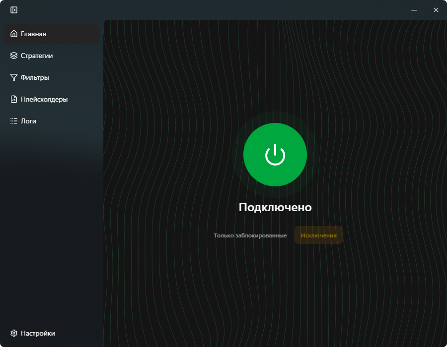

<div align="center">
  

GUI-обёртка для [zapret(-win-bundle)](https://github.com/bol-van/zapret-win-bundle) с предустановленными стретегиями/фильтрами и другими настройками с удобным графическим интерфейсом для их редактирования/добавления/удаления

</div>

## 📸 Скриншот

<div align="center">
  
</div>

## ⚡ Требования

- Windows 10/11 x64
- Запуск от имени администратора (для WinDivert драйвера)
- WebView2 Runtime (устанавливается автоматически)

## 📥 Установка

Готовый установщик можно скачать из [последних релизов](https://github.com/Noktomezo/ZapretInteractive/releases).

## 🛠️ Разработка

### Требования

- [Visual Studio Build Tools](https://visualstudio.microsoft.com/visual-cpp-build-tools/) с выбранным **Desktop development with C++** (MSVC + Windows SDK)
- [Bun](https://bun.com/)

### Команды

```bash
# Установка зависимостей
bun install

# Запуск в режиме разработки
bun tauri dev

# Сборка релиза
bun tauri build
```

## 🙏 Респект

- [bol-van/zapret](https://github.com/bol-van/zapret)
- [bol-van/zapret-win-bundle](https://github.com/bol-van/zapret-win-bundle)

&nbsp;

<div align="center">
  
  <p>Made with 💜. Published under <a href="LICENSE">MIT license</a>.</p>
</div>
